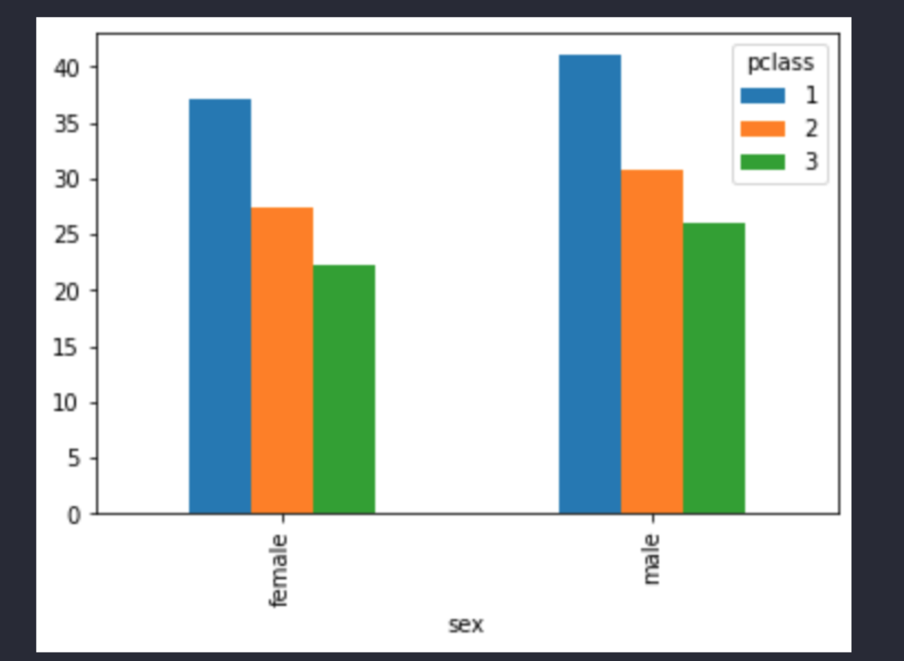

# Python Data Analysis & Visualization Masterclass 2022 - Colt Steele

This is a one-page summary of my notes from Colt Steele's excellent Udemy course, [Python Data Analysis & Visualization Masterclass](
https://www.udemy.com/course-dashboard-redirect/?course_id=4397644).

# Table of Contents

<!-- TOC -->

- [Python Data Analysis & Visualization Masterclass 2022 - Colt Steele](#python-data-analysis--visualization-masterclass-2022---colt-steele)
- [Sections 1, 2, 3](#sections-1-2-3)
- [Section 4: Dataframes & datasets](#section-4-dataframes--datasets)
  - [Quick exploratory analysis](#quick-exploratory-analysis)
    - [Retrieving number of rows and columns](#retrieving-number-of-rows-and-columns)
    - [Quick overview of all data](#quick-overview-of-all-data)
    - [Quick overview of datatypes only](#quick-overview-of-datatypes-only)
  - [pandas reconfiguration](#pandas-reconfiguration)
  - [Headers](#headers)
    - [Overriding default headers](#overriding-default-headers)
- [Section 5: Basic Dataframe computations](#section-5-basic-dataframe-computations)
  - [`.sum()` & `.count()`](#sum--count)
    - [Using `.count()`](#using-count)
    - [Common `sum()` arguments](#common-sum-arguments)
  - [Mean, median, mode](#mean-median-mode)
  - [`.describe()`](#describe)
- [Section 6: Series & Columns](#section-6-series--columns)
  - [Important series methods](#important-series-methods)
  - [Ranking by one column](#ranking-by-one-column)
  - [Selecting multiple columns](#selecting-multiple-columns)
  - [Fundamentals of `value_counts()`](#fundamentals-of-value_counts)
  - [Combining `.plot()` with `.value_counts()` to create a quick plot](#combining-plot-with-value_counts-to-create-a-quick-plot)
- [Section 7: Indexing & Sorting](#section-7-indexing--sorting)
  - [Changing the index of a dataframe after importing](#changing-the-index-of-a-dataframe-after-importing)
  - [Changing the index of a dataframe when importing](#changing-the-index-of-a-dataframe-when-importing)
  - [Sorting by values](#sorting-by-values)
    - [Sorting by one column](#sorting-by-one-column)
    - [Sorting by multiple columns](#sorting-by-multiple-columns)
  - [Sorting by index](#sorting-by-index)
  - [Combining sorting and plotting](#combining-sorting-and-plotting)
  - [Returning data by rows](#returning-data-by-rows)
    - [`.loc` - by row label](#loc---by-row-label)
    - [`.iloc` - by row position (_integer_ label)](#iloc---by-row-position-integer-label)
    - [loc & iloc with specific columns](#loc--iloc-with-specific-columns)
- [Section 8: Filtering Dataframes](#section-8-filtering-dataframes)
  - [Filtering dataframes with a boolean series](#filtering-dataframes-with-a-boolean-series)
  - [Filtering with comparison operators](#filtering-with-comparison-operators)
  - [The `between` method](#the-between-method)
  - [The `isin()` method](#the-isin-method)
  - [Combining conditions using AND (&)](#combining-conditions-using-and-)
  - [Combining conditions using OR (|)](#combining-conditions-using-or-)
  - [Bitwise negation](#bitwise-negation)
  - [Filtering by missing values: `isna` and `notna` methods](#filtering-by-missing-values-isna-and-notna-methods)
- [Section 9: Adding & Removing columns](#section-9-adding--removing-columns)
  - [Dropping values](#dropping-values)
  - [Adding static columns](#adding-static-columns)
  - [Adding dynamic columns](#adding-dynamic-columns)
    - [Summing columns](#summing-columns)
    - [Calculating new values for columns](#calculating-new-values-for-columns)
- [Section 11: Working with Types and NA values](#section-11-working-with-types-and-na-values)
  - [Casting types with `astype()`](#casting-types-with-astype)
  - [Introducing the Category type](#introducing-the-category-type)
  - [Casting with `pd.to_numeric()`](#casting-with-pdto_numeric)
  - [dropna() and isna()](#dropna-and-isna)
    - [Dropping na values on a series](#dropping-na-values-on-a-series)
    - [Dropping na values on a dataframe](#dropping-na-values-on-a-dataframe)
  - [`fillna` - Replacing na values with another value](#fillna---replacing-na-values-with-another-value)
- [Section 12: Working with Dates & Times](#section-12-working-with-dates--times)
  - [Converting with pd.to_datetime()](#converting-with-pdto_datetime)
  - [Specifying date formats](#specifying-date-formats)
  - [Converting columns to datetimes](#converting-columns-to-datetimes)
  - [Useful `dt` properties](#useful-dt-properties)
  - [Comparing Dates](#comparing-dates)
  - [Date math & Timedeltas](#date-math--timedeltas)
- [Section 13: Matplotlib](#section-13-matplotlib)
  - [Multiple plots](#multiple-plots)
  - [Figsize and plot dimensions](#figsize-and-plot-dimensions)
  - [Changing the plot style](#changing-the-plot-style)
  - [Adding labels](#adding-labels)
    - [Changing x and y ticks](#changing-x-and-y-ticks)
  - [Adding legends to plots](#adding-legends-to-plots)
  - [Binning data](#binning-data)
  - [Creating different types of plots](#creating-different-types-of-plots)
  - [Examples](#examples)
    - [Pie chart](#pie-chart)
    - [Titanic histogram, added transparency](#titanic-histogram-added-transparency)
    - [Plant size bar plot - not stacked](#plant-size-bar-plot---not-stacked)
    - [Plant size bar plot - stacked](#plant-size-bar-plot---stacked)
  - [Creating subplots](#creating-subplots)
- [Section 14: Revisiting pandas plotting](#section-14-revisiting-pandas-plotting)
  - [Inline](#inline)
  - [Creating a basic plot inline](#creating-a-basic-plot-inline)
  - [Renaming labels of a series](#renaming-labels-of-a-series)
  - [Pandas bar plots](#pandas-bar-plots)
    - [Stacked bar plot](#stacked-bar-plot)
    - [Stacked horizontal bar plot](#stacked-horizontal-bar-plot)
  - [Examples](#examples-1)
    - [Plotting artist with most weeks at #1 in a horizontal bar chart](#plotting-artist-with-most-weeks-at-1-in-a-horizontal-bar-chart)
    - [Plotting one song in an exploded pie chart](#plotting-one-song-in-an-exploded-pie-chart)
  - [Two ways to do pandas histograms](#two-ways-to-do-pandas-histograms)
  - [Multiple plots on the same axes](#multiple-plots-on-the-same-axes)
    - [Count of UFOs by two states, CA & TX](#count-of-ufos-by-two-states-ca--tx)
    - [Count of UFOs by state](#count-of-ufos-by-state)
- [Section 15: Grouping & aggregating](#section-15-grouping--aggregating)
  - [Split - Apply - Combine](#split---apply---combine)
  - [Using the `agg()` method](#using-the-agg-method)
    - [Summary:](#summary)
  - [Agg with custom functions](#agg-with-custom-functions)
  - [Naming aggregated columns](#naming-aggregated-columns)
- [Section 16: Hierarchical Indexing](#section-16-hierarchical-indexing)
  - [Sorting a multi-index](#sorting-a-multi-index)
  - [Using `.loc[]` with a multi-index](#using-loc-with-a-multi-index)
  - [Cross Sections with the XS method](#cross-sections-with-the-xs-method)
  - [`get_level_values()`](#get_level_values)
    - [Using `get_level_values()` for boolean masking](#using-get_level_values-for-boolean-masking)
  - [Hierarchical columns](#hierarchical-columns)
  - [Stack and unstack](#stack-and-unstack)
  - [Plotting with `unstack()`](#plotting-with-unstack)
    - [Plotting without unstacking](#plotting-without-unstacking)
    - [Unstacking first, then plotting](#unstacking-first-then-plotting)
    - [Unstacking by a particular label, then plotting](#unstacking-by-a-particular-label-then-plotting)
  - [Grouping by index](#grouping-by-index)
- [Section 17: Working with Text](#section-17-working-with-text)
  - [The string datatype vs. object datatype](#the-string-datatype-vs-object-datatype)
  - [Stripping whitespaces with strip()](#stripping-whitespaces-with-strip)
  - [Splitting text values with split()](#splitting-text-values-with-split)
    - [Splitting right-to-left](#splitting-right-to-left)
  - [Replacing portions of strings with replace()](#replacing-portions-of-strings-with-replace)
    - [Writing custom functions to replace text](#writing-custom-functions-to-replace-text)
  - [Testing strings with `contains()`](#testing-strings-with-contains)
- [Section 18: Apply, Map, & Applymap](#section-18-apply-map--applymap)
  - [Example](#example)
  - [apply() with lambdas and arguments](#apply-with-lambdas-and-arguments)
  - [apply() with dataframes: columns](#apply-with-dataframes-columns)
  - [The Series map() method](#the-series-map-method)
  - [The ApplyMap() method](#the-applymap-method)
- [Section 19: Combining Series & Dataframes](#section-19-combining-series--dataframes)
  - [Concatenating Series](#concatenating-series)
  - [Concatenating series by object](#concatenating-series-by-object)
  - [Inner vs. outer joins](#inner-vs-outer-joins)
  - [The dataframe merge() method](#the-dataframe-merge-method)
    - [Merge() w/ Left, Right, Inner, & Outer Joins](#merge-w-left-right-inner--outer-joins)
    - [Merge() on and suffixes argument](#merge-on-and-suffixes-argument)
- [Section 20: Seaborn](#section-20-seaborn)
  - [load_dataset() in seaborn](#load_dataset-in-seaborn)
  - [Seaborn scatterplots](#seaborn-scatterplots)
    - [Other useful parameters:](#other-useful-parameters)
  - [Seaborn lineplots](#seaborn-lineplots)
  - [Types of plot](#types-of-plot)
    - [the relplot() method](#the-relplot-method)

<!-- /TOC -->

# Sections 1, 2, 3

> These are skipped as they are introductory and don't cover any serious information.

# Section 4: Dataframes & datasets

## Quick exploratory analysis

### Retrieving number of rows and columns

```python
df.shape
```

### Quick overview of all data

```python
df.info()
```

### Quick overview of datatypes only

```python
df.dtypes
```

## pandas reconfiguration

If you want to force-reconfigure pandas to display 15 rows at a time:

```python
pd.options.display.min_rows = 15
```

## Headers

### Overriding default headers

If there is no header data, you can provide it with the `names=` argument. Also, set `header=` to zero.

```python
names = ['sumlev', 'region', 'division', 'state', 'name', 'census2010pop',
'estimatesbase2010', 'popestimate2010', 'popestimate2011',
'popestimate2012', 'popestimate2013', 'popestimate2014',
'popestimate2015', 'popestimate2016', 'popestimate2017',
'popestimate2018', 'popestimate2019', 'popestimate042020', 'popestimate2020']
state_pops = pd.read_csv("data/nst-est2020.csv", names=names, header=0)
state_pops
```

Standard import lines:

```python
import pandas as pd
path =  "/Users/harryramsay/Documents/GitHub/Udemy/python-data-science-2022/DataAnalysis"
netflix = pd.read_csv(path + "/data/netflix_titles.csv", sep="|", index_col=0)
netflix
```

# Section 5: Basic Dataframe computations

<details>
<summary>What do you get if you run <code style="white-space:nowrap;">houses.min()</code> over an entire dataframe?
</summary>
Minimum values for every column.
</details>

## `.sum()` & `.count()`

### Using `.count()`

`df.count()` just tells you the non-null values for each column.

### Common `sum()` arguments

Here are some arguments that `.sum()` can take:

```python
df.sum(axis=None, skipna=None, level=None, numeric_only=None, min_count=0, **kwargs)
```

`numeric_only` can be set to `True`, meaning it will only bother with numeric columns.

## Mean, median, mode

- **mean**: average
- **median**: value that is in the middle
- **mode** = the most frequent value

## `.describe()`

Used on its own, `.describe()` will return an analysis of _only_ the numeric columns in the dataframe, with analysis of the following:

- count
- mean
- std
- min
- 25%
- 50%
- 75%
- max

If you add the argument `include=[]`, where you provide a list of datatypes that you want included, it could also work on non-numeric fields too.

```python
titanic.describe(include=['object'])
# or you can simply use a capital O, NOT a lowercase one!
titanic.describe(include=['O'])
```

# Section 6: Series & Columns

## Important series methods

- `head()`
- `tail()`
- `describe()`
- `info()`
- `unique()`
  - Series method **only**. Does not work on dataframes.
- `nunique()`
  - If you’re looking up a series with missing values (i.e. `NaN` or null values), you can optionally add `dropna=False` as a parameter to include the null values in the list of unique values. (By default, null values are skipped.)
- `nlargest()`
  - These are both dataframe and series methods - good for quick analysis.
- `nsmallest()`
  - These are both dataframe and series methods - good for quick analysis.
- `value_counts()`
- `plot()`

> Note on `nlargest()` and `nsmallest()`:
> If there are duplicated values, you can use the `keep=` parameter to pick what you want.

- `first` : prioritize the first occurrence(s)
- `last` : prioritize the last occurrence(s)
- `all` : do not drop any duplicates, even it means selecting more than n items.

```python
# all duplicated values are kept:
df.nlargest(3, 'population', keep='all')
```

## Ranking by one column

```python
houses.nlargest(10,["price"])
```

## Selecting multiple columns

Put a _list_ of items within square brackets.

```python
netflix[["title", "rating"]]
```

## Fundamentals of `value_counts()`

> Returns a Series containing counts of unique values.

(By default, it sorts **descending**. Change with `ascending=True`.)

```python
netflix["director"].value_counts().head(10)
```

You can select a subset of columns and run `value_counts()` on that instead:

```python
houses[["bedrooms", "bathrooms"]].value_counts()
```

## Combining `.plot()` with `.value_counts()` to create a quick plot

> By default, it plots the values against the labels (i.e. the index). This is not always helpful.

```python
houses["bedrooms"].value_counts().plot(kind="bar")
```

```python
netflix["rating"].value_counts().head(10).plot(kind="bar")
```

If you’re using a dataframe (NOT a series), you have the option to assign columns to the X or Y axis. Maybe you want to plot bedrooms against bathrooms?

```python
df = houses[["bedrooms", "bathrooms"]]
df.plot(x="bedrooms", y="bathrooms", kind="scatter")
```

# Section 7: Indexing & Sorting

## Changing the index of a dataframe after importing

```python
btc.set_index("Date", inplace=True)
# Now we can check:
btc.index
```

## Changing the index of a dataframe when importing

If you want to use the first column as the index, set the `index_col` property to 0 when importing.

```python
countries = pd.read_csv(path + "/data/world-happiness-report-2021.csv", index_col=0)
```

## Sorting by values

### Sorting by one column

Use `sort_values()` - this is both a dataframe method and a series method.

```python
countries.sort_values(by="Healthy life expectancy", ascending=False)
```

### Sorting by multiple columns

Simply use a list of columns.

```python
houses.sort_values(["bedrooms", "bathrooms"], ascending=False)
```

**IMPORTANT NOTE!**

> When sorting text, uppercase comes before lowercase. That’s why you might see “de la Cruz” after “Zimmerman”.
>
> To fix this, we can use a key and a lambda to modify (this is weirdly complex and I don’t understand why there isn’t a simple fix like `is_capitalized`...)

Here is the fix:

```python
titanic.sort_values("name", key=lambda col: col.str.lower())
```

## Sorting by index

```python
countries.sort_index()
```

(Does not sort in place by default.)

## Combining sorting and plotting

```python
titanic["pclass"].value_counts().sort_index().plot(kind="bar")
```

or:

```python
houses["bedrooms"].value_counts().sort_index().plot(kind="bar")
```

## Returning data by rows

### `.loc` - by row label

For this, we can use `.loc`.

```python
countries.loc["Yemen"]
```

This finds the row where "Yemen" is the index, and returns the data, albeit _not_ as a dataframe. To get it as a dataframe, wrap it in a second set of square brackets:

```python
countries.loc[["Yemen"]]
```

You can pass multiple arguments as a list:

```python
countries.loc[["Canada", "Mexico", "United States"]]
```

And you can also use slices to select a subset of the data:

```python
titanic.loc[5:10]
```

### `.iloc` - by row position (_integer_ label)

```python
houses.iloc[0:5]
```

### loc & iloc with specific columns

Simply add, as a second argument, the **list** of columns you want.

```python
houses.loc[21612:21611, ["price", "bedrooms"]]
```

**NOTE ON PERFORMANCE**

```python
# 1 - columns specified as argument
countries.loc["Canada": "Denmark", ["Ladder score"]]

#2 - columns specified as an extract
countries.loc["Canada": "Denmark"]["Ladder score"]
```

> In this, the first example is more performant because pandas is able to narrow it down first, before needing to run it on the entire dataset.

# Section 8: Filtering Dataframes

## Filtering dataframes with a boolean series

```python
df["sex"] == "female"
```

This will return a **boolean series** (a column of `True` / `False`). You can take that command and plug it into the entire dataframe by plugging the entire query between a `df[]` command, and this will return a **dataframe**.

```python
df[df["sex"] == "female"]
```

## Filtering with comparison operators

```python
houses[houses["price"] > 500000]
```

## The `between` method

If we want to find houses with between 5 to 7 bathrooms, we can run this to return a boolean series:

```python
houses["bedrooms"].between(5, 7)
```

We then plug it into the `houses` df:

```python
houses[houses["bedrooms"].between(5, 7)
]
```

Finally, we can select only the "bedrooms" column and get a count of the houses which have between 5 and 7 bedrooms:

```python
houses[houses["bedrooms"].between(5, 7)]["bedrooms"].value_counts()
```

## The `isin()` method

Again, boolean series:

```python
netflix_countries = ["Japan", "South Korea", "India"]
netflix["country"].isin(netflix_countries)
```

And now plugging into the dataframe:

```python
netflix[netflix["country"].isin(netflix_countries)]["country"].value_counts()
```

## Combining conditions using AND (&)

```python
women = titanic["sex"] == "female"
died = titanic["survived"] == 0
titanic[women & died]
```

Find the houses which are waterfront but also cost less than $500,000.

```python
is_waterfront = houses["waterfront"] == 1
is_cheap = houses["price"] < 500000
houses[is_waterfront & is_cheap]
```

or, running it differently:

```python
houses[(houses["waterfront"] == 1) & (houses["price"] < 500000)]
```

## Combining conditions using OR (|)

Parentheses matter.

```python
fincher = netflix["director"] == "David Fincher"
scorsese = netflix["director"] == "Martin Scorsese"
recent = netflix["release_year"] > 2015
netflix[(fincher | scorsese) & recent]
```

## Bitwise negation

This is done with the tilde character `~` and essentially means "everything _apart from_ this".

```python
df = titanic.head()
women = df["sex"] == "female"
~women
```

**IMPORTANT NOTE!**

When plugging bitwise negations into a dataframe, you'll need to surround it with parentheses otherwise it won't work properly.

```python
titanic[titanic["survived"] == 0]
# now negate this:
titanic[~(titanic["survived"] == 0)]
```

## Filtering by missing values: `isna` and `notna` methods

Filter by movies that do not have either a director or a cast listed.

```python
netflix[netflix["director"].isna() & netflix["cast"].isna()]
```

# Section 9: Adding & Removing columns

## Dropping values

> (Note: `axis=0` = rows, `axis=1` = columns. Axis is 0 by default.)

```python
# 1 - Using both 'labels' and 'axis'
btc.drop(labels=["SNo", "Name", "Symbol"], axis=1)
# 2 - Using only 'columns'
btc.drop(columns=["SNo", "Name", "Symbol"])
```

How to delete the first three rows?

First get the three rows using the `index` method:

```python
countries.index[0:3]
```

then slot this into the `drop` argument:

```python
countries.drop(countries.index[0:3])
```

Another example: This takes everything from 10 onwards as your selection, and that selection is then dropped (in other words, everything before that will stay in the existing dataframe.)

```python
countries.drop(countries.index[10:])
```

## Adding static columns

Assign a value to a new column name. This appends a new column to the end of the existing dataframe.

```python
titanic["species"] = "human"
```

If you want to insert it in a different position, you can use the `insert` method and specify a column index:

```python
houses.insert(0, "county", "King County")
```

(This creates a new column called "county" in position 0 of the table and populates every value with "King County")

## Adding dynamic columns

### Summing columns

```python
titanic["sibsp"] + titanic["parch"]
```

### Calculating new values for columns

Let's calculate the price by square foot, and then sort by most expensive

```python
houses["price_sqft"] = houses["price"] / houses["sqft_living"]
# now find the most expensive per square foot
houses.sort_values("price_sqft", ascending=False)
```

Do certain zip codes have a higher price per square foot?

```python
houses.sort_values("price_sqft", ascending=False).head(50)["zipcode"].value_counts()
```

# Section 11: Working with Types and NA values

## Casting types with `astype()`

If we want to convert, we can use `astype()`.

- object
- int
- float
- category

This does not work in place.

```python
titanic["age"] = titanic["age"].astype("float")
```

## Introducing the Category type

> **Category** = represents text data where there is a finite number of possible values. Gender is a good example.

Why would you use category as a data type?

> Object allows for any type of value - and sets space accordingly, meaning that it might be taking up much more space than we actually need. Casting to a category type, therefore, might be much more efficient.

```python
titanic["sex"] = titanic["sex"].astype("category")
```

## Casting with `pd.to_numeric()`

`pd.to_numeric()` can convert columns to numeric values, BUT it also has the benefit of being able to set an error parameter.

- If set to `raise`, it raises an exception.
- if set to `coerce`, it turns any weird, non-castable item (such as question marks) into a NaN value.
- if set to `ignore`, it returns input.

```python
titanic["age"] = pd.to_numeric(titanic["age"], errors="coerce")
```

## dropna() and isna()

`isna()` returns a boolean dataframe demonstrating whether `na` is present. To filter, plug it back into the main dataframe. Let’s look for all rows that don’t have a league, for example:

```python
stats[stats["league"].isna()]
```

### Dropping na values on a series

This returns a new series (original, not modified) with all null values dropped. You can modify the original with inplace=True.

```python
stats["assist"].dropna()
```

### Dropping na values on a dataframe

This works a bit differently to a series `dropna`. By default, it works on **rows** (`axis=0`) but can be set to work on columns with `axis=1`.

- `how=any`
  - Drop the row or column if **any** NaN values are present.
- `how=all`
  - Drop the row or column **only if all values are NaN.**

By default, it uses “any”.

We can also use `subset` to provide a **_list_** of labels that we want it to look at. For example, if we want to drop rows where we don’t have any value for “league”. You could pass multiple columns, if you like.

```python
stats.dropna(subset=["league"])
```

## `fillna` - Replacing na values with another value

This replaces every null value in a dataframe with 0.

```python
stats.fillna(0)
```

If you only want to do this on certain columns, you can provide a dictionary of values to replace with for that column:

```python
stats.fillna({"points": 0, "assists": 0, "rebounds": 0, "league": "amateur"})
```

You can fill with values from another column. Let’s say we want to fill any NaN values in shipping with the existing values in billing.

```python
sales["shipping_zip"].fillna(sales["billing_zip"], inplace=True)
```

# Section 12: Working with Dates & Times

## Converting with pd.to_datetime()

This converts many different items to a datetime object.

```python
pd.to_datetime("2019-12-31")
```

It's extremely flexible with date input formats. All of the following formats are supported, plus more.

```
2019-12-31
2019-31-12
12-31-2019
31-12-2019
31/12/2019
31.12.2019
12-31-19
December 31st 2019
Dec. 31st 19
2019-31-12 11:59pm
2019-31-12 23:59
2019-31-12 23:59:45
```

## Specifying date formats

What if the date is ambiguous, like `10-11-12` ?
You can add `dayfirst=True`. (`yearfirst = True` is also an option.)

We can also specify the specific format we need.

```python
pd.to_datetime("10/11/12", format="%y/%m/%d")
```

[Full documentation for various datetime formats can be found at this link.](https://docs.python.org/3/library/datetime.html#strftime-and-strptime-behavior)

You can be flexible with this, even including text:

```python
pd.to_datetime(meetings, format="%b %d % Y Meeting")
```

This will convert to something like "Dec 11 2019 Meeting", "Jan 6 2019 Meeting", etc.

## Converting columns to datetimes

Does not work in place.

```python
ufos["date_time"] = pd.to_datetime(ufos["date_time"])
```

(Alternatively, use the `parse_dates` argument in `pd.read_csv()` and allow it to be read in correctly from the beginning (it requires a list).)

## Useful `dt` properties

Timeseries and date functionality can be found [here](https://pandas.pydata.org/pandas-docs/stable/user_guide/timeseries.html#time-date-components).

The following code will return only the "year" component from the "date_time" column.

```python
ufos["date_time"].dt.year
```

You can return the date like this::

```python
ufos["date_time"].dt.date
```

We could count and plot the number of years in which there were sightings:

```python
ufos["date_time"].dt.year.value_counts().head(10).plot(kind="bar")
```

## Comparing Dates

We may want to filter using dates - a date or a time that came before or after `x`. This gives us a boolean series. (Note that you need to use quotes.)

```python
ufos["date_time"] < "1980"
```

You can then "plug this in" to the main dataframe to filter it.

```python
ufos[ufos["date_time"] < "1980"]

```

```python
recent_sightings = ufos[ufos["date_time"].dt.year >= 2018]
recent_sightings.sort_values("date_time")
recent_sightings["date_time"].dt.date.value_counts()
```

## Date math & Timedeltas

The following code returns a "time delta", i.e. a gap between two points in time.

```python
ufos["posted"] - ufos["date_time"]
```

Here's a typical task that may need solving:

- Work with the homes sold between May 1st 2014 and May 1st 2015.
- Within that year, find the waterfront homes that were sold.
- Which quarter of that year had the most waterfront home sales? The least?
- Create a bar plot showing the number of waterfront home sales per quarter.

```python
house_subset = houses[houses["date"].between("2014-05-01", "2015-05-01")]
house_subset[house_subset["waterfront"] == 1]["date"].dt.quarter.value_counts().sort_index().plot(kind="bar")
```

# Section 13: Matplotlib

First import matplotlib.

```python
import matplotlib.pyplot as plt
```

`plt.plot()` takes two arguments - `x` and `y`., as well as other stuff if needed.

x and y need to be “array-like data” (a list, a NumPy array, a pandas Series, etc.)

- If we pass in **two** values, it acts as though it’s `x` then `y`, in that order.
- If we pass in only a **single** value, it treats it as the `y` value. It makes up its own `x` axis, starting at 0 and incrementing by 1.

Note:

- If we use `plt.plot()` in a normal Python file, it **won’t** display.
- If we use it in a Jupyter notebook, it **will** display.

We can create a numpy array by using `np.arange(5)` with the number of items that you want in this array.

```python
np.arange(5)
# array([0,1,2,3,4])
```

## Multiple plots

If you run `plt.plot()` twice, it will add both to the same "figure" - in other words, it will display both graphs on the same canvas.

> A "figure" is the highest level canvas at which matplotlib operates. Think of it as the whole "page" of the output.

> Within this figure, we can have multiple "axes". Each of these can be a plot.

By default, calling `plt.figure()` with empty params creates a new figure, which is made active and returned. Everything after that line of code will return inside a new figure.

```python
plt.figure()
plt.plot(nums, nums)

plt.figure()
plt.plot(nums, nums)
plt.plot(nums, nums*nums)
plt.plot(nums, nums**3)
```

## Figsize and plot dimensions

> (Note: for some reason, the default unit of size used here is inches.)

You can use `figsize` to specify dimensions for your chart. It accepts a **tuple**, and the default size is `(6.4, 4.8)`.

## Changing the plot style

There are preconfigured stylesheets that we can apply. To find these, use `plt.style.available`.

Changing the style can be done like this:

```python
plt.style.use("fivethirtyeight")
```

You can give each plot more specific details:

```python
plt.style.use("ggplot")
plt.plot(nums, nums, color="olive")
plt.plot(nums, nums*nums, color="#ff6b6b")
plt.plot(nums, nums**3, c="#ff9f43", linewidth=5, linestyle="dashed")
```

You can add markers like this:

```python
plt.style.use("ggplot")
plt.plot(nums, nums, color="olive", marker="*", markersize=20, markerfacecolor="orange")
```

## Adding labels

> Technically, we are labelling the axes, not the figures.

```python
plt.style.use("ggplot")
plt.plot(nums, nums, color="olive", marker="*", markersize=20, markerfacecolor="orange")
plt.title("Orange Stars on an Olive Background")
plt.xlabel("x-axis going up")
plt.ylabel("y-axis going up")
```

### Changing x and y ticks

The ticks are the values showing up on the x and y axes. We can also provide labels.

```python
plt.xticks([20, 25, 30, 35, 40, 45])
```

plt.xlim() , without parameters, returns the start and stop values for the x and y axis, so you can see what’s what. You can pass in parameters if you want to set them.

## Adding legends to plots

First we need to provide labels for each plot line. Then we can call the `plt.legend()` function (with no parameters).

```python
plt.figure(figsize=(8,8))
plt.plot(nums, color="teal", label="x")
plt.plot(nums**2, color="olive", label = "x squared")
plt.plot(nums**3, color="purple", label="x cubed")
plt.legend(frameon=True, shadow=True,facecolor="white")
```

## Binning data

> By default, bin size is set to 10.

## Creating different types of plots

- `plt.bar()`
- `plt.hist()`
- `plt.scatter()`
- `plt.pie()`

## Examples

### Pie chart

```python
plt.figure(figsize=(8,8))
plt.pie(costs,
        labels=labels,
        colors=colors,
        explode=(0,0.1,0,0,0.1),
        autopct='%.0f%%'
        )
plt.title("School District Cost Breakdown")
plt.show()
```


### Titanic histogram, added transparency

```python
first_class = titanic[titanic["pclass"] == 1]["age"]
second_class = titanic[titanic["pclass"] == 2]["age"]
third_class = titanic[titanic["pclass"] == 3]["age"]


plt.hist(first_class, label="First Class", alpha=0.5)
plt.hist(second_class, label="Second Class", alpha=0.5)
plt.hist(third_class, label="Third Class", alpha=0.5)
plt.legend()
```


### Plant size bar plot - not stacked

```python
plt.figure(figsize=(6,6))
plt.bar(plants, died)
plt.bar(plants, germinated, width=0.4, align="edge")
plt.title("Failure Rates")
plt.ylabel("Number of dead seedlings")
```


### Plant size bar plot - stacked

```python
plt.figure(figsize=(6,6))
plt.bar(plants, died, bottom=germinated, label="Failed")
plt.bar(plants, germinated, label="Germinated Seedlings")
plt.legend()
plt.title("Failed vs. Germinated Seedlings")
```


## Creating subplots

```python
nums = np.arange(5)
plt.figure(figsize=(10,4))
# suptitle, as in supertitle, which is the title of the entire figure
plt.suptitle("Our First Subplot", fontsize=30)
# 1 row, 3 columns, index of 1 (i.e. working on first chunk)
plt.subplot(1,3,1)
plt.title("X")
plt.plot(nums, nums, color="blue")

# now we set it to the second subplot
plt.subplot(1,3,2)
plt.title("X squared")
plt.plot(nums, nums**2, color="red")
# now we set it to the third subplot
plt.subplot(1,3,3)
plt.title("X cubed")
plt.plot(nums, nums**3, color="yellow")

# Finally, we get pandas to tidy everything up for us
plt.tight_layout()
plt.show()
```


# Section 14: Revisiting pandas plotting

## Inline

We can specify additional information inline:

```python
titanic["sex"].value_counts().plot(kind="bar", title="Males vs. females on Titanic", xlabel="gender")
```

This is quick, but gives less granularity and control compared to using the full matplotlib functions.

You can start adding after the initial plot (remember, this creates a "most recent" instance to which all following instructions will apply).

```python
titanic["sex"].value_counts().plot(kind="bar", xlabel="gender", figsize=(8, 6))
plt.title("Males vs. females on Titanic")
plt.show()
```

## Creating a basic plot inline

```python
ufos["month"] = ufos["date_time"].dt.month
sightings = ufos["month"].value_counts().sort_index()
sightings.plot(
    kind="bar",
    title="UFO Sightings by month",
    xlabel="Month",
    ylabel="Number of sightings",
    figsize=(9,6))
plt.show()
```


## Renaming labels of a series

Can be used to rename the **labels** of a series (i.e. the **index** can be renamed from 1, 2, 3 to January, February, March). This takes a dictionary as input, and does **not**, by default, change things inplace.

```python
sightings.rename({1: "Jan", 2: "Feb", 3:"Mar"})
```

## Pandas bar plots

### Stacked bar plot

```python
df.head(10).plot(kind="bar", stacked=True)
```

### Stacked horizontal bar plot

```python
df.sort_values("OvertimePay", ascending=False).head().plot(kind="barh", stacked=True)
```

## Examples

### Plotting artist with most weeks at #1 in a horizontal bar chart

```python
charts
num_1s = charts[charts["rank"] == 1]
num_1s["artist"].value_counts().head(10).plot(
    kind="barh",
    figsize=(8,6),
    edgecolor="black",
    linewidth=3)
plt.style.use("ggplot")
plt.title("Artists with most weeks at #1")
plt.xlabel("Weeks at #1")

plt.show()
```


### Plotting one song in an exploded pie chart

```python
colors = ["#6c5ce7","#00cec9", "#74b9ff"]
postman = charts[charts["song"] == "Please Mr. Postman"]["artist"].value_counts()
postman.plot(
kind="pie",
figsize=(8,8),
colors=colors,
explode=(0,0,0.1),
)
plt.title("Please Mr. Postman versions", fontsize=26)
plt.ylabel("artist", fontsize=16)
plt.show()
```


## Two ways to do pandas histograms

```python
# Maps everything onto one figure.
df.plot(kind="hist")
```

```python
# Maps every aspect of the df onto its own axis
df.hist()
```

## Multiple plots on the same axes

### Count of UFOs by two states, CA & TX

```python
ufos[ufos["state"] == "CA"].year.value_counts().sort_index().plot(kind="line")
# if you want to break them up:
# plt.figure()
ufos[ufos["state"] == "TX"].year.value_counts().sort_index().plot(kind="line")
```


### Count of UFOs by state

```python
ufos[ufos["state"] == "CA"].year.value_counts().sort_index().plot(kind="line", label="CA", figsize=(8,6))
ufos[ufos["state"] == "TX"].year.value_counts().sort_index().plot(kind="line", label="TX")
plt.legend(loc="upper left")
plt.style.use("ggplot")
plt.xlabel("Year")
plt.ylabel("Number of sightings")
plt.title("UFO Sightings by State", fontsize=25)
```


# Section 15: Grouping & aggregating

The main purpose of `groupby` is to answer this question: How do we calculate the average price for various things without doing it individually?

Here, we are performing analyses on the price of car stocks:


**Without** groupby:

```python
carstocks[carstocks["Symbol"] == "RIVN"]["Close"].mean()
```

**With** groupby:

```python
carstocks.groupby("Symbol")["Close"].mean()
```

Breakdown:

- use the `groupby()` method
- pass in the “Symbol” column from this dataset, because that’s what we want to group by (e.g. the average value for "RIVN")
- select the “Close” (i.e. closing price) column on which to perform the analysis
- tell it we want the mean price by calling the `mean()` method.

> Note: by default, if you run `df.groupby("gender")`, pandas will return a groupby object. The following image roughly breaks down what it is doing behind the scenes:


You can check how many groups are in the groupby object by using `ngroups`:

```python
gbo = df.groupby("gender")
gbo.ngroups
# 2
```

You can also use `.groups` to get a dictionary of all of the group objects.


We can get the first member of every group in a dataframe by using `first()`.

If we want to get all the members of a certain group, such as all females from our gbo object:

```python
gbo.get_group("female")
```


We can also iterate/loop over the object - which gets us a tuple which contains the group name and the actual group in our groupby object.

```python
for name, group in gbo:
    print(name)
    print("-----")
    print(group)
```

## Split - Apply - Combine

This is a way of analysing information.

- **Split** the data into different groups based on some criteria
- **Apply** function(s) to each group independently
- **Combine** the results into a new data structure

Let's assume you created a groupby object from the entire dataframe, called `gbo`. We can run **series**-level analysis on this by using square brackets to select the column, then performing the calculation:

```python
# Let's find the average age by sex:
gbo["age"].mean()
```

Another example:

```python
titanic.groupby("pclass")["age"].mean()
```

Breakdown:

- Let’s apply `groupby` to the Titanic dataframe.
- We want to group by `pclass`.
- Then let’s select the `age` column.
- Finally, we use the `mean()` method.

## Using the `agg()` method

> This allows us to run multiple functions on a groupby object. (Up until now, we’ve been using single functions, like `mean()`.)

```python
titanic.groupby("sex").agg("min")
```

Here, we’re grouping by sex, and then returning the **minimum** for each **column** for each **group**.

So far, this is only using one calculation (`min`). However, using `agg` allows us to perform multiple calculations:

```python
titanic.groupby("sex")["age"].agg(["min", "max"])
```


Let's say that for each sex, we want to know the minimum and maximum ages, **and** we want to know the average `pclass` per sex. For this, we can pass in a dictionary of aggregate functions we want pandas to run.

```python
titanic.groupby("sex").agg({"age": ["min", "max"], "pclass": "mean"})
```

Another example: let's say that we want to understand the average open price and the average close price for each "symbol" in the car database:

```python
carstocks.groupby("Symbol").agg({"Open": "mean", "Close": "mean"})
```

### Summary:

`.agg()` can take:

- single items
- a list
- a dictionary

## Agg with custom functions

Let’s use the Titanic dataframe and say that we want to find out the difference between the highest and lowest ages by passenger class.

```python
def range(x):
    return x.max() - x.min()
titanic.groupby("pclass")["age"].agg(range)
```

> NOTE!! For custom functions, **don’t pass it as a string** (i.e. don’t pass "range"). This is fine for pre-existing pandas functions, but for custom functions, leave it as a variable.

## Naming aggregated columns

Let’s find the min open, max open, min close and max closing prices.

```python
carstocks.groupby("Symbol").agg("Open":["min", "max"], "Close":["min"
, "max"])
```


What if we’d prefer to have “proper” named columns, such as “min_close”, etc?

Instead of providing a dictionary, we can provide:

- **new** **column name** as a keyword argument, followed by:
  - a tuple
    - first value: column you’re trying to work with
    - second value: the “min” function (or whatever you need)

This should make for a cleaner result.

```python
carstocks.groupby("Symbol").agg(
    min_open=("Open", "min"),
    max_open=("Open", "max"),
    min_close=("Close", "min"),
    max_close=("Close", "max")
    )
```


# Section 16: Hierarchical Indexing

When we group by two different columns (here, both `sex` and `pclass`), we still get a series back, but we now have two indices (a **multi-index**).


The index is now both `pclass` AND `sex` - a list of tuples.


Here is a dataset with one index:


Unfortunately, this is not much good, as the values are not unique. Therefore, we can set a multi-index instead to both `state` and `year`.

```python
pops = pd.read_csv(path + "/data/state_pops.csv")
pops.set_index(["state", "year"])
```


## Sorting a multi-index

If we simply run `pops.sort_index()`, pandas will sort firstly by state and then year. By default, it’s ascending.

Specify the **level** of the index (the leftmost one would be 0, the next would be 1, and so on) and whether or not you want it ascending.

```python
pops.sort_index(ascending=[False, True], level=[0,1])
```

> Order doesn’t matter - you could do it with `level` first and then `ascending` second.

## Using `.loc[]` with a multi-index

Find the population for Montana in 1992.

> NOTE! The convention here is to use a **tuple**. You can pass in the comma-separated arguments without the tuple and it should work, but it’s safer to use the tuple.

```python
pops.loc[("MT", 1992)]
```

> NOTE OF CAUTION:

> The `.loc[]` syntax means that you can pass in the label of the index (here, `19`) and then a comma, and then a column name in quotes. This will return the data from the “name” column with an index of 19.

> That is why `pops.loc[:,1990]` does not work; pandas thinks you’re trying to access the “1990” column, and it does not exist.

> Therefore, to say “give me all instances from the first index but only give me the data where the second index is 1990”, you have to write:

```python
pops.loc[:,1990,:]
```


## Cross Sections with the XS method

This is an easier way to get a portion of a dataframe that is multi-indexed by **one** part of the index.

We use the `.xs()` method (for cross-section) and then provide:

- a **value**
- a **level**

```python
pops.xs(2013, level="year")
```

## `get_level_values()`

You can use df.index.levels to get a list of lists, which contain the values of each of the indices.

```python
pops.index.levels

# FrozenList([['AK', 'AL', 'AR', 'AZ', 'CA', 'CO', 'CT', 'DC', 'DE', 'FL', 'GA', 'HI', 'IA', 'ID', 'IL', 'IN', 'KS', 'KY', 'LA', 'MA', 'MD', 'ME', 'MI', 'MN', 'MO', 'MS', 'MT', 'NC', 'ND', 'NE', 'NH', 'NJ', 'NM', 'NV', 'NY', 'OH', 'OK', 'OR', 'PA', 'PR', 'RI', 'SC', 'SD', 'TN', 'TX', 'USA', 'UT', 'VA', 'VT', 'WA', 'WI', 'WV', 'WY'], [1990, 1991, 1992, 1993, 1994, 1995, 1996, 1997, 1998, 1999, 2000, 2001, 2002, 2003, 2004, 2005, 2006, 2007, 2008, 2009, 2010, 2011, 2012, 2013]])
```

If you want to narrow it down and only get the values for one particular level:

```python
pops.index.get_level_values(0)

# Index(['AL', 'AL', 'AL', 'AL', 'AL', 'AL', 'AL', 'AL', 'AL', 'AL',
#       ...
#      'USA', 'USA', 'USA', 'USA', 'USA', 'USA', 'USA', 'USA', 'USA', 'USA'],
#      dtype='object', name='state', length=1272)
```

Of course, you can then sub-select what you need:

```python
pops.index.get_level_values(0)[100]
# 'CA'
```

### Using `get_level_values()` for boolean masking

```python
even_years = pops.index.get_level_values(1) % 2 == 0
pops[even_years]
```


## Hierarchical columns

What if we want to get data for males in passenger class 2?

```python
df = titanic.groupby(["pclass", "sex"].mean())
```


```python
df.loc[(2, "male")]
```


Here is an example of something with hierarchichal columns:


There are two ways to access this.

1:

```python
df[("age", "mean")]
```

2:

```python
df["age"]["mean"]
```


The first way is better, because pandas only retrieves the necessary information. In the second example, it retrieves **every** value for “age” and _only then_ narrows it down to the “mean” column.

## Stack and unstack

[Link to pandas documentation on stacking and unstacking](https://pandas.pydata.org/docs/reference/api/pandas.DataFrame.unstack.html)


> **Explanation of unstacking:**
>
> > When we have a dataframe with a multi-index, when we **unstack** it, we take a level of the index and basically pivot it over to an actual column, rather than an index label.

Here is the standard multi-index data:


However, if we run:

```python
pops.unstack()
```


We now have a column for each year. So it took the right-most column index and turned everything into its own column.

We can also provide a level - either a number, or the index name:

```python
pops.unstack(level="state")
```

`.stack()` also exists, but it is used a lot less than `unstack()`. Here is an example:


## Plotting with `unstack()`

### Plotting without unstacking

```python
titanic.groupby(["pclass", "sex"])["age"].mean().plot(kind="bar")
```

This kind of works, but is very clunky.


### Unstacking first, then plotting

```python
titanic.groupby(["pclass", "sex"])["age"].mean().unstack().plot(kind="bar")
```


### Unstacking by a particular label, then plotting

You could also specify to unstack by a label of pclass if you wanted:

```python
titanic.groupby(["pclass", "sex"])["age"].mean().unstack(level="pclass").plot(kind="bar")
```



## Grouping by index

What if we want to group things together by the `year` portion of the index and then sum them together?

You can pass in `level=` to the groupby function.

```python
pops.groupby(level=1).sum()
```


(A more elegant way is to just use the name of the index:)

```python
pops.groupby("year").min()
```

# Section 17: Working with Text

## The string datatype vs. object datatype

Object is the most generic datatype in pandas. They are not limited to strings - could also be booleans, numbers, etc. Interestingly, there is currently not much of a performance boost between the two types.

You can’t do this - it will throw an error:

```python
titanic["name"].lower()
```

Instead, you need to specify the str method:

```python
titanic["name"].str.lower()
```

This returns a new series - it does not change the original.

## Stripping whitespaces with strip()

> NOTE: It removes only leading and trailing spaces, not ALL spaces. It also removes newline and tab characters (from the end).

If you just want to strip either leading characters or ending characters, use lstrip or rstrip respectively.

## Splitting text values with split()

```python
titanic["home.dest"].str.split()
```

By default, this splits on the space character. If we don’t want this, we can supply a character in quotes:

```python
titanic["home.dest"].str.split("/")
```

By default, pandas returns a list. However, if we prefer to split into their own columns, we can pass in a parameter called `expand` and set it to True.

```python
titanic["home.dest"].str.split("/", expand=True)
```

> NOTE: We can limit the number of times it can split with `n=1`:

```python
titanic["home.dest"].str.split("/", expand=True, n=1)
```


We could select just the first one and then create a new column to check the home of each passenger:

```python
titanic["home"] = titanic["home.dest"].str.split("/", expand=True)[0]
```


### Splitting right-to-left

You can also use `rsplit` which splits from right to left instead of the default `split` behaviour of left to right.

## Replacing portions of strings with replace()

```python
ufos["duration"].str.replace("seconds", "s")
```

You can also use regex:

```python
ufos["duration"].str.replace("seconds|minutes", "")
# or
ufos["duration"].str.replace("seconds|minutes", "", regex=True)
```

Note: Will work fine without regex=True, but better to specify it.

### Writing custom functions to replace text

You can write custom functions. Here’s one that replaces either the word “seconds” or “minutes” with its first character:

```python
def abbrev(reo):
    return reo.group()[0]

ufos["duration"].str.replace("seconds|minutes", abbrev)
```

## Testing strings with `contains()`

```python
ufos["duration"].str.contains("hour")
```

> **IMPORTANT NOTE**: this preserves `NaN`. Because of this, you cannot use this as a boolean mask (because boolean masks must contain **only** `True` or `False` values) - and _anything_ else, including NaN values, makes it throw an error.

To fix this, we can pass in a further argument which allows it to convert `na` values to something else (in our case, `False` seems like a good bet).

```python
ufos["duration"].str.contains("hour", na=False)
```

Here’s a way to return any row which contains a value corresponding to either “day”, “week”, or “month”:

```python
ufos[ufos["duration"].str.contains("day|week|month", na=False)]
```

# Section 18: Apply, Map, & Applymap

We’ll start with the `Series` apply method, then move on to dataframes.

It takes a function, then invokes that function on every value in the series and returns a new series. (It **_can_** return a dataframe, but by default it’s a series unless otherwise specified.)

Let’s define a function to turn years into days:

```python
def years_to_days(yrs):
    return yrs * 365

titanic["age"].apply(years_to_days)
```

> **NOTE** that it’s not `years_to_days()`, but rather just `years_to_days` (without parentheses). We are not invoking it directly - we are passing it to `apply()` so that `apply()` can do the work and invoke it for us.

## Example

```python
def get_age_group(age):
    if age < 2:
        return "infant"
    elif age < 12:
        return "child"
    elif age < 18:
        return "teen"
    elif age < 50:
        return "adult"
    else:
        return "senior"

# now we create a new column:
titanic["age_group"] = titanic["age"].apply(get_age_group)
```

We could run some exploratory data analysis, like checking for the average survival rate per group:

```python
titanic.groupby("age_group")["survived"].mean()
```


## apply() with lambdas and arguments

When is this actually necessary? For simple calculations, it may not be. For instance, if the 1912 dollar value can be adjusted for inflation by multiplying by 24, we could simply do this:

```python
titanic["fare"] * 24
```

However, for more complex operations (like if we want to put a dollar sign in front of it), we would need to use either a function or a lambda.

```python
titanic["fare"].apply(lambda x: f"${x*24}")
```

What if we have more than one argument, though? Imagine we create a currency converter:

```python
def convert_currency(num, multiplier):
    return f"${num * multiplier}"

convert_currency(2, 24)

# '$48'
```

We can pass through `args=` as an additional parameter with a tuple (Note: this **HAS** to be within a tuple even though we’re only supplying one argument. It looks odd, but it's correct.)

```python
titanic["fare"].apply(convert_currency, args=(24,))
```

## apply() with dataframes: columns

This is more complex, but only because we can apply a function either horizontally or vertically.

If you don’t specify an axis, it will default to `0`, which applies it to columns.

```python
def get_range(s):
    return s.max() - s.min()

df.apply(get_range)
```

## The Series map() method

> This is ONLY a series method, and does not exist on dataframes.

Helps us to map a series of values to another series of values based upon some argument (like a function, dictionary, another series, etc.) Generally we use it when we want to transform the data in some way. (Maybe we want to turn “1” into “1st”, 2 into “2nd”, etc.)

```python
titanic["pclass"].map({1:"1st", 2:"2nd", 3:"3rd"})
```

## The ApplyMap() method

> This is a dataframe-only method and does not work for series.

It takes a function and runs it with every single value in the dataframe. Doesn’t care about rows vs. columns, etc. Then it constructs a new dataframe based on those new values.

```python
titanic[["name", "sex", "age_group"]].applymap(str.upper)
```


# Section 19: Combining Series & Dataframes

## Concatenating Series

> (Concatenating is like stacking a series one on top of the other.)

There’s a method called `concat` which is neither a series nor a dataframe method - it is a pandas method, similar to `to_datetime()`. It works to concatenate either a **series** or a **dataframe**, and requires a **list**.

```python
s1 = pd.Series(["a", "b", "c"])
s2 = pd.Series(["d", "e", "f", "z"])

pd.concat([s1, s2])
```

It preserves the index by default, but you can get it to ignore this and generate a new one.

```python
pd.concat([s1, s2], ignore_index=True)
```

## Concatenating series by object

Think of this as horizontal concatenating - i.e. making a new dataframe. Same as before, just set axis=1.

- **What it is NOT doing:**
  - putting one next to the other
- **What it IS doing:**
  - pairing by existing index from the original series (pairing 0 red with 0 green, for instance)

We can also pass in a list with `keys=[val1, val2]` to name the columns.

## Inner vs. outer joins

By default, it’s outer, but could be inner.

## The dataframe merge() method

This is more powerful than `pd.concat` when it comes to merging dataframes.

This is a dataframe method, not a pandas method. We call it on our first dataframe that we want to start with. (if we’re merging teams and cities, we’d start with `teams.merge(cities)`, for example)

### Merge() w/ Left, Right, Inner, & Outer Joins

- `on=`
  - By default, pandas will choose. However, you should probably specify the column to join on.
- `how=`
  - default type is **inner**.
  - can use something else like `left`

### Merge() on and suffixes argument

If you want to join on first name, this will be a problem if there’s more than one instance of it.

```python
midterms.merge(finals, on=["first", "last"])
```

What happens with score_x and score_y?


This happens because we’re not joining on score, but score exists in both dataframes. This is where suffixes can come in handy.

```python
midterms.merge(finals, on=["first", "last"], how="inner", suffixes=("_midterms", "_finals"))
```


# Section 20: Seaborn

> Seaborn is built on top of matplotlib.

[Link to documentation](https://seaborn.pydata.org/)

## load_dataset() in seaborn

This fetches practice datasets and returns a pandas dataframe so we can practice using seaborn.

```python
tips = sns.load_dataset("tips")
```

## Seaborn scatterplots

We can use `sns.scatterplot` for this.

Generally, we need:

- `data=`
- `x=`
  - column name
- `y=`
  - column name

This broadly applies across most of seaborn, not just on scatterplots.

```python
sns.scatterplot(data=tips, x="total_bill", y="tip")
```

We can change the default seaborn theme:

```python
sns.set_theme()
```

### Other useful parameters:

```python
# hue = adds colour to differentiate between values within one column
sns.scatterplot(data=tips, x="total_bill", y="tip", hue="smoker")
```

```python
# style = changes the shape of each dot
sns.scatterplot(data=tips, x="total_bill", y="tip", style="time")
```

```python
# size = changes size of each dot
sns.scatterplot(data=tips, x="total_bill", y="tip", size="size")
```

## Seaborn lineplots


> By default, these plot the **mean**, not the _sum_.

If we don’t want this, we can change it by changing the `estimator=`.

```python
sns.lineplot(data=flights, x="year", y="passengers", estimator="sum")
```

Lineplot automatically sorts by the x-axis (if you don’t want this, specify `sort=false`)

## Types of plot


- **relplot (relational)**
  - scatterplot
  - lineplot
- **displot(distributions)**
  - histplot
  - kdeplot
  - ecdfplot
  - rugplot
- **catplot (categorical)**
  - stripplot
  - swarmplot
  - boxplot
  - violinplot
  - pointplot
  - barplot

### the relplot() method

> "relplot" = relational plot.

Seaborn refers to this as a “figure-level” function, versus the two that we’ve seen (`scatterplot` and `lineplot`) which are **axes**-level functions. If we use relplot, therefore, we can create multiple sub-plots with a single line of code.

There are only **two kinds** of relplots:

- **scatter**
- **line**

> By default, a relplot produces a scatter plot.

```python
sns.relplot(data=tips, x="total_bill", y="tip", col="sex")
```
